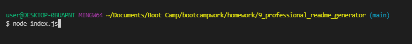
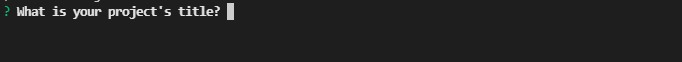

# Professional README Generator

Bootcamp Homework #9

## Description 
I have created a ccommand line application that allows users to create a professional README markdown file to include with their project's documentation. It creates common README sections like description, usage, contributions, and license information. Additionally, the program allows them to include a responsive table of contents. 
    
## Table of Contents

- [Installation](#installation)
- [Usage](#usage)
- [License](#license)
- [Contributions](#contributions)
- [Tests](#tests)
- [Questions](#questions)

## Installation
This application requires Node and users should run "npm install" in their command line prior to use. 

## Usage
After installing Node and running "npm install" users will open their command line and initiate the program by typing "node index.js". 

Then answer the questions with the information you would like included in your README. 

After entering all of your information, the program will create a README file in your folder. 

Here is a screencast of how the program runs. 

[Video of creator using the program](https://watch.screencastify.com/v/jm1b2txhnvXwFx7ktnXj)

## License
This project licensed under the [MIT License](https://opensource.org/licenses/MIT).

## Contributions
Not accepting contributions

## Tests
Project runs with expected input. 

## Questions
Please email any questions to <ljhofer@gmail.com> or reference my [GitHub profile](https://github.com/ljhofer). 

